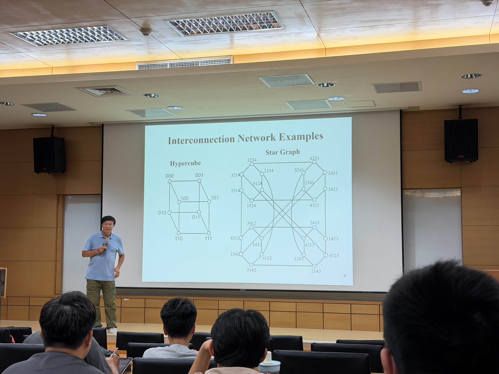
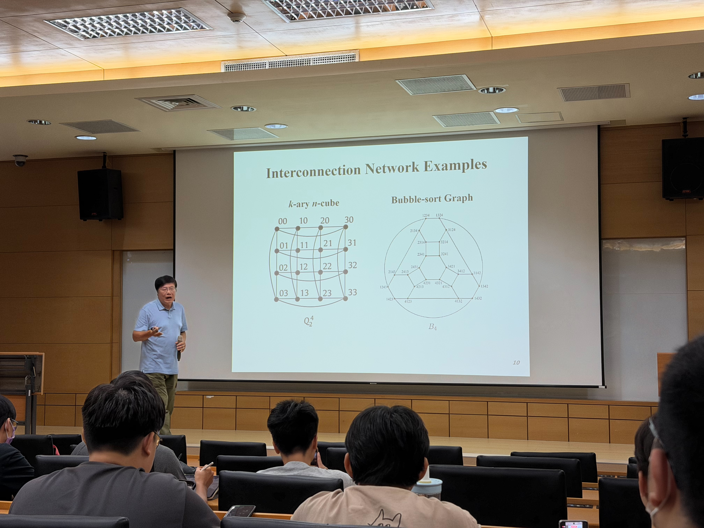
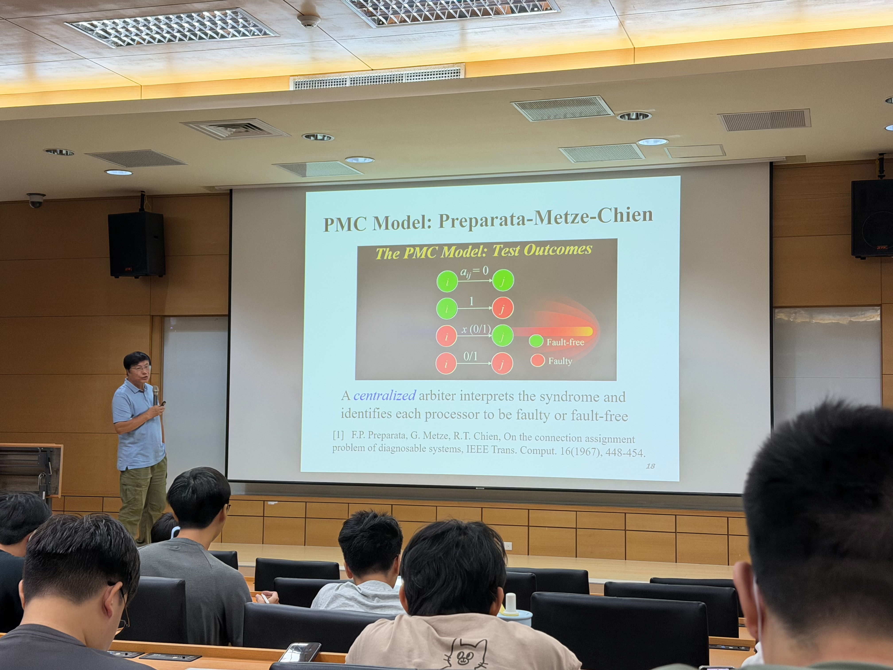
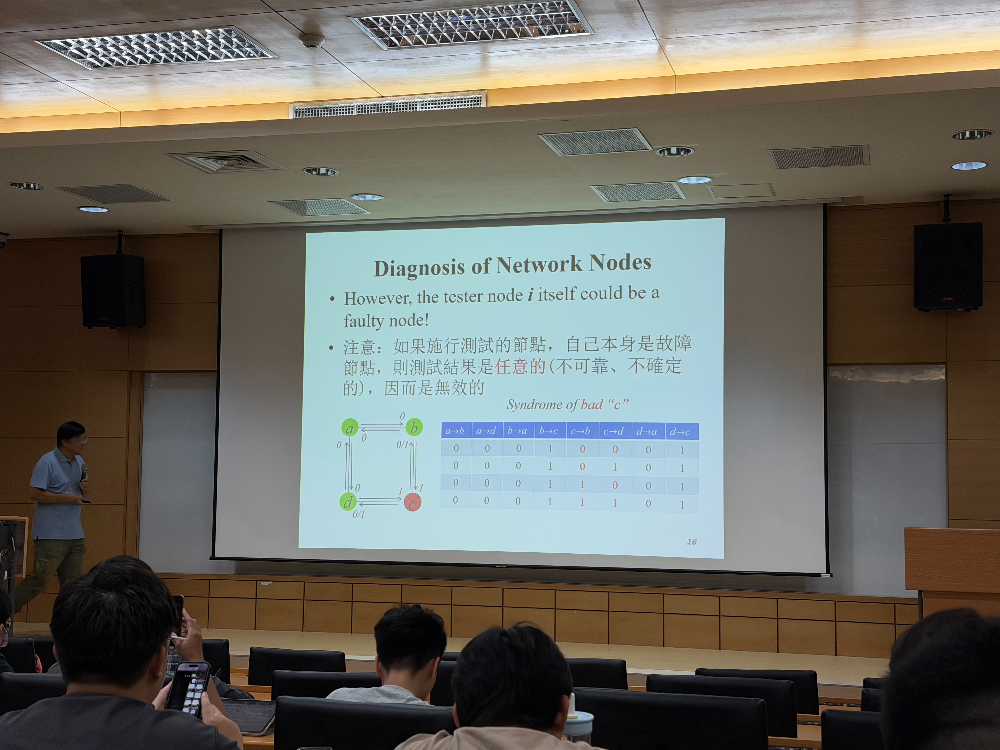
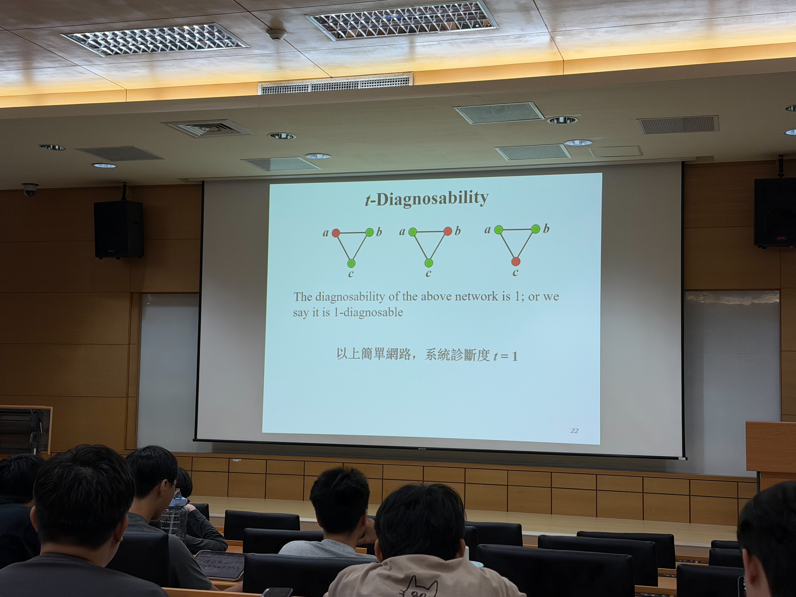
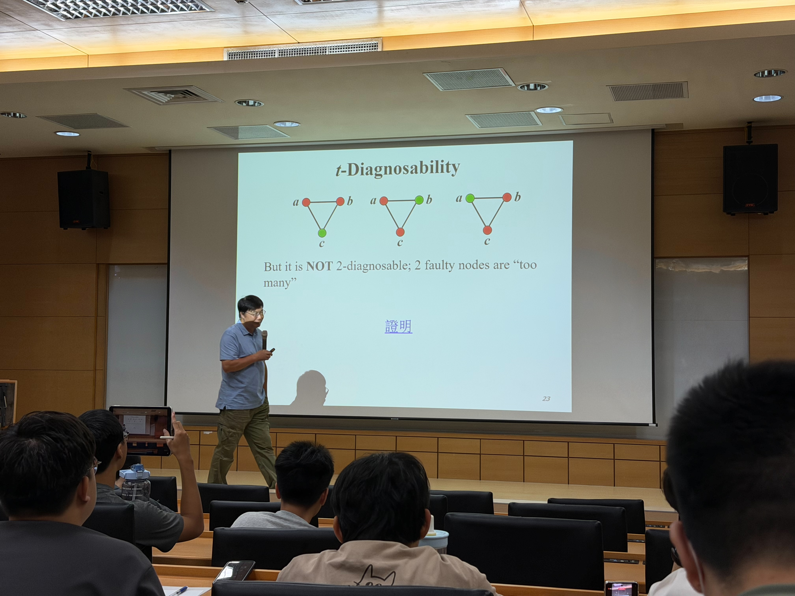
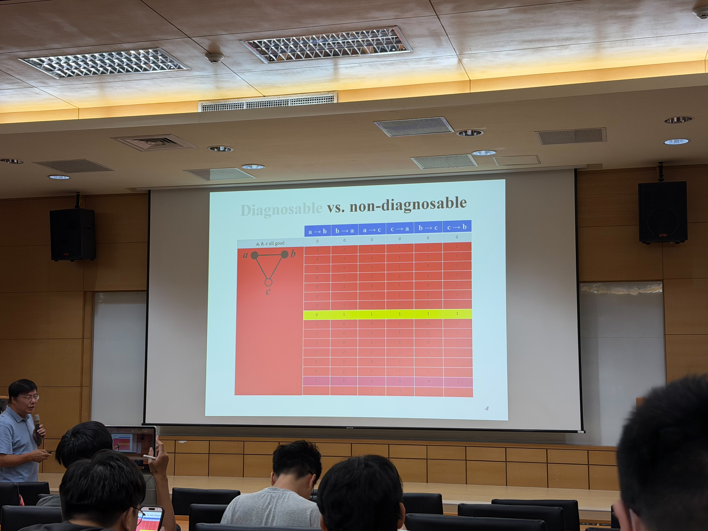

# System-level Diagnosis - An Introduction and Recent Results

## 研究領域介紹：網路診斷與容錯

> **演講者**：Dr. Da-jin Wang（王大進博士）  
> **演講日期**：2026/09/15

王大進博士本次演講主要介紹 **System-level Diagnosis（系統層級診斷）** 的基本概念，核心問題是：**如何透過網路節點之間互相測試，找出系統中發生故障的節點？**

---

## 壹、Motivation and Background

隨著網路規模不斷擴大，尤其現今系統高度依賴雲端運算與分散式架構，網路已成為資訊系統中不可或缺的一環。然而，當系統規模增加時，也會伴隨兩個重要問題：

- **網路攻擊與系統故障的風險提高**
- **系統整體可靠度可能隨節點數量增加而下降**

例如：即使單一處理器本身具有很高的可靠度，在「**無備援（No Redundancy）**」的架構下，當大量處理器共同組成系統時，只要其中任一處理器故障，都可能造成整體系統失效，因此整體可靠度反而會隨系統規模增加而下降。

這時候就衍伸出一個重要問題：**當系統中有節點發生故障時，要如何判斷是哪一個節點出了問題？**

其中一種方法就是：**透過網路節點彼此進行測試，根據測試結果找出故障節點。**

---

## 貳、Interconnection Network Examples

網路節點之間的互連方式非常多，常見的較複雜拓樸包含以下幾種：

- **Hypercube（超立方體）**：又稱 $n$-dimensional Hypercube，記作 $Q_n$。每個節點可以使用一組 $n$ 位元的二進位數表示，共有 $2^n$ 個節點。如果兩個節點的二進位表示中 **只有一個 bit 不同**，則兩個節點之間存在一條連線。

- **Star Graph（星狀圖）**：排列式的 Star Graph 記作 $S_n$。每一個節點代表 $1 \sim n$ 的一種排列，節點總數為 $n!$。兩個節點之間的連接方式，是透過將排列中的第一個元素與其他位置的元素交換。

- **k-ary n-cube**：可視為 Hypercube 的一般化形式。每一個節點使用 $n$ 個座標表示，而每個座標可以取 $0 \sim k-1$，因此節點總數為 $k^n$。

- **Bubble-sort Graph（氣泡排序圖）**：一種以「排列」作為節點的網路，記作 $B_n$。共有 $n!$ 個節點，每一個節點代表 $1 \sim n$ 的一種排列。不同於 Star Graph 可以將第一個元素與其他位置交換，Bubble-sort Graph 只允許 **交換相鄰的兩個元素**。

例如節點 `1234` 可以變成 `2134`、`1324` 或 `1243`，分別代表交換第 1–2、第 2–3、第 3–4 個元素。因此，每個節點共有 $n-1$ 個鄰居。

---

## 參、PMC Model

PMC Model 的基本概念是：**由一個節點去測試另一個節點是否正常。**

假設節點 $u$ 測試節點 $v$，記作：

$u \to v$

在測試者 $u$ 本身為正常節點時：

- 若 $v$ 正常，測試結果為 `0`
- 若 $v$ 故障，測試結果為 `1`

但是，如果負責測試的節點 $u$ 本身已經故障，那麼它所產生的測試結果便 **不可信**。

不論下一個節點實際上是正常或故障，都可能回報 `0` 或 `1`。

### PMC Model 測試對照表

| 測試節點 | 被測試節點 | 測試結果 |
| --- | --- | --- |
| 正常 | 正常 | `0` |
| 正常 | 故障 | `1` |
| 故障 | 正常 | `0` 或 `1` |
| 故障 | 故障 | `0` 或 `1` |

---

## 肆、四個節點的範例

假設系統共有 4 個節點，每個節點都與另外 2 個節點相連。若考慮所有有方向的測試關係，總共有：

$4 \times 2 = 8$

個測試結果。

當系統中有 **1 個節點故障**，且該故障節點需要測試另外兩個節點時，由於 PMC Model 規定 **故障節點產生的測試結果不可信**，因此每一條由故障節點發出的測試都可能為 `0` 或 `1`。

故障節點共有 2 個不確定的測試結果，因此可能的組合數為：

$2^2 = 4$

也就是單一故障節點可能產生 **4 種不同的測試結果組合（Syndrome）**。

---

## 伍、Syndrome

在 PMC Model 中，所有節點互相測試後得到的一整組結果稱為 **Syndrome**。

例如一個系統具有 6 個測試：

$a\to b,\quad b\to a,\quad a\to c,\quad c\to a,\quad b\to c,\quad c\to b$

若某次測試結果為：

$(0,1,0,1,0,0)$

這整組結果就是一個 Syndrome。

系統會根據不同的 Syndrome，推測可能的故障節點集合。

---

## 陸、t-Diagnosability（診斷度）

節點診斷法的重要限制是：**故障節點的數量不能太多。**

假設存在一個關鍵數值 $t$。如果系統中故障節點數量不超過 $t$ 時，所有可能的故障集合都可以透過 Syndrome 被唯一辨識，那麼這個網路稱為：

$t$-diagnosable

而 $t$ 就稱為系統的 **Diagnosability（診斷度）**。

### 範例：三個節點的三角形網路

假設 $a,b,c$ 三個節點彼此相連。

#### 1. 只有 1 個節點故障（$t=1$）

不論故障集合是：

$F=\{a\}$

$F=\{b\}$

或：

$F=\{c\}$

三種情況所可能產生的 Syndrome 都不會互相重疊。

只要觀察 Syndrome，就能唯一判斷是哪一個節點發生故障，因此此系統具備 **1-diagnosable** 的能力。

#### 2. 出現 2 個節點故障（$t=2$）

由於故障節點產生的測試結果可以任意為 `0` 或 `1`，兩個故障節點可能產生大量不同的 Syndrome。

某些 Syndrome 可能與：

- 只有 1 個節點故障
- 另一組 2 個節點故障

產生完全相同的結果。

此時系統便無法唯一判斷真正的故障集合，因此 **不具備 2-diagnosable 的能力**。

---

### 實例：假設 $a,b$ 同時故障

假設故障集合為：

$F=\{a,b\}$

也就是 $a,b$ 故障，而 $c$ 正常。

- 正常節點 $c$ 的測試結果可信：

  $c\to a=1$

  $c\to b=1$

- 故障節點 $a,b$ 發出的測試結果皆不可靠：

  $a\to b,\quad b\to a,\quad a\to c,\quad b\to c$

  每一個結果都可以是 `0` 或 `1`。

這 4 個不確定的測試結果共可產生：

$2^4=16$

種 Syndrome。

問題在於，其中某個 Syndrome 可能同時由兩種不同的故障集合產生，例如：

$F_1=\{c\}$

與：

$F_2=\{a,b\}$

**當同一個 Syndrome 可能對應兩種不同的故障情況時，系統僅憑 Syndrome 便無法判斷真正的故障集合。**

---

## 捌、t-Diagnosable 的必要條件

對於網路：

$G=(V,E)$

若希望系統具備 $t$-diagnosable 的能力，必須滿足一些重要的必要條件。

### 1. 節點數量

$\lvert V \rvert \ge 2t+1$

節點總數至少需要 $2t+1$ 個，代表系統需要有足夠數量的節點，才能區分不同的故障集合。

### 2. 點連通度

$\kappa(G)\ge t$

網路的 **vertex connectivity（點連通度）** $\kappa(G)$，代表至少需要移除多少個節點，才會使原本連通的網路變成不連通。

當：

$\kappa(G)\ge t$

代表網路具有足夠的連通性，使系統在存在一定數量故障節點時，仍能進行故障診斷。

> **注意：**  
> $\kappa(G)$ 表示「點連通度」，而不是節點的最小度數。  
> 最小度數通常記作 $\delta(G)$。

---

## 玖、心得

我認為這次王大進教授主要是拋出一個基礎概念，讓我們能夠進一步思考網路診斷與容錯的問題。

實際上的網路節點與拓樸結構往往比課堂中的簡化模型更加複雜。以上述幾種網路架構而言，在實際系統中可能存在更多額外的連線，因此進行故障節點診斷時，問題也可能更加複雜。

這次演講也讓我體會到，**並不是所有的 Algorithm 都適用於所有問題**。針對不同的問題與系統架構，找出適合的演算法與診斷方式十分重要。

雖然這次演講主要介紹的是基礎概念，但 System-level Diagnosis、PMC Model 與 t-Diagnosability 等觀念，對於未來理解網路可靠度、系統容錯與相關研究仍具有一定的幫助。

---

## 拾、關鍵字

- **t-Diagnosable**
- **Syndrome**
- **PMC Model**
- **Connection Assignment**

---

## 拾壹、參考文獻

- Preparata, F. P., Metze, G., & Chien, R. T. (1967). **On the Connection Assignment Problem of Diagnosable Systems**. *IEEE Transactions on Electronic Computers*, EC-16.